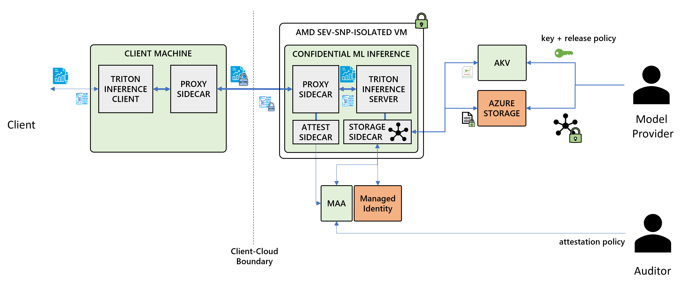

# Confidential ML Inference Service Architecture
We first describe the confidential ACI platform, and then the threat model and the architecture for the confidential ML inference service.

## Confidential Containers on ACI

Azure Container Instances (ACI) provide means to execute serverless container groups in the cloud. Container groups are hosted in utility VMs, which are isolated from other container groups that may be co-running on the same host.

The Confidential Containers on ACI platform (illustrated in the figure above) leverages VM-based trusted execution environments (TEEs) based on AMD’s SEV-SNP technology. The TEE provides memory encryption and integrity of the utility VM’s address space as well as hardware-level isolation from other container groups, the host operating system, and the hypervisor. The Root-of-Trust (RoT), which is responsible for managing the TEE, provides support for remote attestation, including issuing an attestation report which may be used by a relying party to verify that the utility VM has been created and configured on a genuine AMD SEV-SNP CPU. The report includes the platform’s SVN and launch measurement digest of the address space of the utility VM at boot time, enabling platform- and VM-level remote attestation.

Confidential containers also support container-level integrity and attestation via the security policy, which prescribes the container group that is permitted to run within the utility VM (i.e., set of containers, the entry point and command attributes, and environment variables) and is enforced by the utility VM’s container runtime. A container image is uniquely identified by a chain of hashes; one hash for each layer corresponding to the root hash of the layer’s integrity tree. The utility VM mounts the container’s root filesystem (comprising the container image layers + read/write scratch layer) with integrity protection to guarantee container integrity throughout the container’s execution. The security policy is presented to the RoT during the boot phase of the utility VM and is encoded in the attestation report as an immutable attribute. 

ACI customers are expected to import their data/application encryption keys (for decrypting their sensitive data) to a key management service that supports secure key release, such as the Azure Key Vault, which enables users to import keys bound to a key release policy; an example of such policy specifies the expected security policy and utility OS.  The keys can then be released to the container group if the container group presents hardware-backed attestation claims that match the key release policy.  

## Confidential ML Inference Service
We first review the threat model and then describe the architecture.

### Threat Model
We assume a powerful attacker who may gain control of the Azure infrastructure  as well as the communication channel between the client and the service. This means that all code running outside the container group’s TEE (i.e., the utility SEV-SNP VM) is untrusted. The trusted computing base (TCB) excludes the host operating system and the hypervisor. The TCB includes 
the utility VM, including all components running within the VM and the container group, including (a) the guest operating system, the user-space root filesystem, and the container runtime deployed by the container platform and (b) possibly a collection of infrastructure sidecar containers deployed within the container group by the container service provider. 

The confidential ML service  relies on a collection of sidecar containers to provide secure communication between client and server and to mount encrypted filesystems storing confidential models. These sidecar containers run within the container group, and hence are included in the attestation and are trusted.  Finally, these sidecars rely on Microsoft Azure Attestation (MAA) and Azure Key Vault (AKV) for retrieving the model encryption keys. These services are part of the TCB, run in remote TEEs, and hence they are attestable and protected from Azure infrastructure and operators.

The service and client may rely on a certificate authority (CA) for TLS certificates. The CA is trusted for attributes such as ownership of a domain name, but not trusted for the security properties of the channel. 

Under this threat model, we wish to guarantee the following properties. 
- **Attestation.** The service running in the container group TEE is attested by the model service provider and the clients using the service. Attestation is based on generated hardware reports and includes the utility VM’s trusted computing base, the set of containers that are permitted run within the service, and finally the signer of the deployed model(s).  
- **Confidentiality.** Data sent over the network, including the remote filesystem storing the model, and the client-service communication appears in plaintext only within the TEE.
- **Integrity.**  Data received over the network, including the remote filesystem storing the model, and the client-service communication, cannot be modified by attackers without detection. 

### Architecture

#### **Overview**

The figure above illustrates the architecure of the proposed confidential ML inference service. 

**Preperation.** the model provider signs and encrypts the model in a clean room (on their premises). Signing is done using private/public cryptography (e.g., elliptic-curve) and encryption is done using an AES variant. The provider then uploads the encrypted model and the encryption key to Azure Storage and Azure Key Vault, referred to as AKV. The model provider also provisions a user-assigned managed identity, which is assigned the required Azure Resource Control roles for the Azure Storage and AKV resources. 

**Deployment.** The service comprises the Triton inference server and a collection of sidecar containers, responsible for providing attested TLS connection between the client and server and access to encrypted filesystems. The proxy sidecar, responsible for transparent attested TLS, possesses two certificates: one domain certificate and one TEE-specific self-signed certificate. The proxy sidecar utilizes the attestation sidecar to retrieve a TEE-specific token via Microsoft Azure Attestation (MAA) that captures the self-signed certificate as a claim. The storage sidecar utilizes three identity tokens: a token for authenticating with Azure Storage and another one for authenticating with Azure Key Vault, and a TEE-specific token via MAA for authorizing secure key release. The first two tokens are retrieved via the managed identity assigned to the container group during deployment. 

The TEE-specific tokens are issued by MAA in response of validating the attestation report against the certificate chain endording the attestation signing key. The token authors various claims capturing the security properties of the VM (hosting the container group.)

The client uses an http proxy that establishes an attested TLS connection with the attested service, over which they submit inference requests.

#### **Server**
The server is deployed as a container group consisting of the inference container and three sidecar containers:

*Inference Container.* We utilize a container running the NVIDIA Triton inference server built for CPU-only inference of ONNX runtime models. We extend the container with model attestation, which entails verifying the model using the public key of the model signer before the inference server is started. The public key is passed as a base64-encoded string attribute to the container’s entry point, and hence is included in the attestable security policy.

*Encrypted Filesystem Container.* We utilize a sidecar container to mount a remote encrypted filesystem (storing the model and its signature) previously uploaded to Azure Blob Storage by the model provider. The filesystem is encrypted using a key owned by the model provider, which has been imported to Azure Key Vault and is bound to a key release policy. 

The sidecar container transparently retrieves the hardware attestation and the certificate chain endorsing the attestation’s signing key. It then requests Microsoft Azure Attestation (MAA) to authorize an attestation token, which is required for securely releasing the filesystem’s encryption key from Azure Key Vault. The key is released to the sidecar container only if the attestation token is signed by the expected authority and the attestation claims match the key’s release policy. Finally, the sidecar container transparently uses the key to mount the remote encrypted filesystem; this process will preserve the confidentiality and integrity of the filesystem upon any operation from a container running within the container group.

*Attestation Container.* We utilize a sidecar container to expose a local REST API (to containers running within the container group) over which they can retrieve a raw attestation report or an MAA token.

*Proxy sidecar with attested TLS.* We utilize an init container that configures HTTP traffic generated by the inference server container to be intercepted and forwarded to a proxy sidecar container. The proxy sidecar container implements an attested TLS protocol for establishing a secure channel with the client. All TLS connections are transparent to the inference server and are terminated within this proxy sidecar container.

Attested TLS is a TLS extension that is used to cryptographically bind the TLS handshake with the attestation report of the ACI deployment. The server generates a fresh certificate-based identity for the TEE and generates an attestation over this identity (by retrieving an MAA token via the attestation container which presents the identity as a run-time claim.) During a TLS handshake with the client, the attested TLS extension makes use of this TEE-specific identity to cryptographically sign the transcript of the key exchange, binding the TLS session created to the TEE-specific identity. The TLS handshake terminates in the proxy sidecar and is completely transparent to the inference server. 

#### **Client**
The client consists of the client and a proxy sidecar container:

*Triton client.* We use an unmodified triton client which submits inference query requests to the Triton server via an HTTP proxy.

*HTTP proxy sidecar with attested TLS.* The HTTP proxy implements the client-side attested TLS protocol. The proxy verifies the validity of the attested TLS signature and the TEE-specific identity of the signer including platform and initialization claims---e.g., if debugging is disabled, if the utility OS is compliant, if the security policy matches the expected one. If the verification succeeds, the TLS handshake proceeds. Subsequently, all traffic sent by the client via the proxy will be transmitted over the attested TLS connection.
